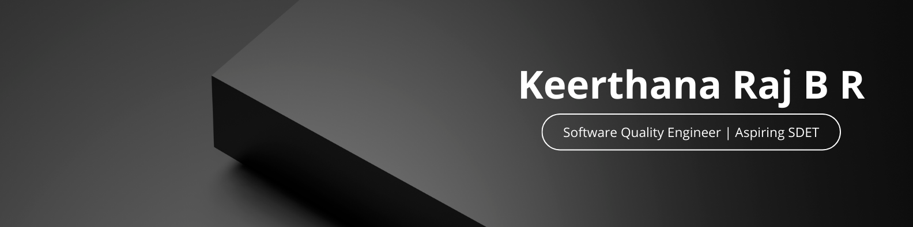

  

<h1 align="center">
   Hi, I’m Keerthana Raj B R 👋
</h1>

  🧪 Software Quality Engineer | Python Learner | Aspiring SDET   
  🎯 4.3+ years of experience in manual testing of enterprise applications

---

## 👩‍💻 Professional Summary

Software Quality Engineer with 4.3 years of experience in manual and functional testing of enterprise web applications. Strong understanding of the Software Testing Life Cycle (STLC), defect management, and backend data validation using SQL. Hands-on exposure to Python fundamentals, Robot Framework execution, and API testing using Postman. Actively transitioning towards an SDET role with a strong focus on automation, backend testing, and logical problem-solving.

---

## 🛠️ Core Skills

### 🧪 Testing & QA
- Manual Testing, Functional Testing  
- Regression Testing, Smoke Testing, Sanity Testing  
- Test Case Writing, Test Scenario Preparation  
- Test Plan Creation & Test Execution  

### 🐞 Defect Management
- Defect Identification & Bug Reporting  
- Defect Tracking & Lifecycle Management  
- JIRA, qTest  

### 🔄 Process & Methodologies
- SDLC, STLC  
- Agile Methodology, Scrum  

### 🌐 API & Database Testing
- API Testing (Postman – Basic)  
- SQL (Basic)  
- Backend & Database Validation  

### 🤖 Automation (Learning Phase)
- Python (Fundamentals & Logic Building)  
- Robot Framework (Execution & Analysis)  

### 💡 Quality & Soft Skills
- Requirement Analysis  
- Analytical & Problem-Solving Skills  
- Documentation & Communication  
- Quality-focused mindset  

---

## 💼 Professional Experience

### **Software Quality Engineer**  
**Infosys Ltd | 2021 – Present**

- Performed end-to-end manual testing of enterprise web applications across multiple releases.
- Designed, reviewed, and executed test cases based on business requirements and user stories.
- Identified, logged, and tracked defects using JIRA and qTest, ensuring proper defect lifecycle management.
- Conducted regression and smoke testing to ensure application stability after fixes and enhancements.
- Validated backend data using SQL queries to ensure data accuracy and integrity.
- Performed manual API testing using Postman to validate request/response behavior.
- Collaborated closely with developers, business analysts, and product owners in Agile sprint cycles.
- Executed and analyzed Robot Framework test cases and supported automation test runs.

---

## 🏆 Awards & Recognition

- **Insta Award – Client Appreciation**  
  Recognized for strong understanding of user stories, identifying functional gaps, and reducing UAT defects through effective testing.

- **Insta Award – Quality Excellence**  
  Awarded for consistent contribution to quality assurance and maintaining high testing standards.

---

## 🎓 Education

**Bachelor of Technology (B.Tech)**  
RIET | 2017 – 2021  
**CGPA:** 8.27

---

## 🧰 Tools & Technologies

- JIRA  
- Postman (Basic)  
- SQL Developer (Basic)  
- Python  
- Robot Framework  
- qTest  
- MS Excel  
- Web Applications Testing  

---

## 🎯 Current Focus

- Strengthening Python fundamentals & problem-solving skills  
- Building clean, structured Python practice repositories  
- Transitioning into **SDET / QA Automation** roles  

---

## 🌱 Learning Philosophy

> “A tester’s job is not just to find bugs — but to question logic.”  
> “Correct behavior matters more than perfect-looking code.”

Thanks for visiting my profile 😊  
Always learning, always testing, always improving 🚀
